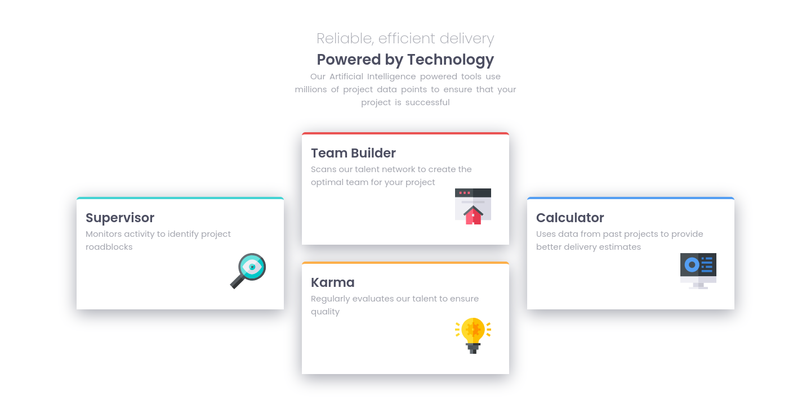

# Frontend Mentor - Four card feature section solution Español

Esta es una solución para el [Four card feature section challenge on Frontend Mentor](https://www.frontendmentor.io/challenges/four-card-feature-section-weK1eFYK). Los retos de Frontend Mentor pueden ayudarte a mejorar tus habilidades por medio de crear proyectos reales.

## Tabla de contenidos
- [Información general](#información-general)
  - [El reto](#el-reto)
  - [Screenshot](#screenshot)
  - [Links](#links)
- [Mi proceso](#mi-proceso)
  - [Herramientas utilizadas](#herramientas-utilizadas)
  - [Lo que aprendí](#lo-que-aprendí)
- [Autor](#autor)

## Información general

### El reto

- Ver correctamente el diseño dependiendo la resuloción del dispositivo.

### Screenshot

Mobile version

Desktop version

### Links

- URL para la solución: [Solution page]()
- URL para probar el sitio: [Github pages]()

## Mi proceso

### Herramientas utilizadas

- HTML
- CSS
- CSS Grid
- Mobile-first workflow

### Lo que aprendí

En este ocasión decidí empezar a usar una metodologia de css como BEM, Atomic CSS, DOCSS, etc.

Aprendí [BEM](http://getbem.com/introduction/), porque en [The State of CSS 2020](https://2020.stateofcss.com/en-US/technologies/methodologies/) estaba en primero en uso.

Realmente me gusto y quiero ver cuanto código puedo re usar en mi proximo proyecto.

## Autor

- Frontend Mentor - [@Caresle](https://www.frontendmentor.io/profile/Caresle)
- Instagram - [@caresle1](https://instagram.com/caresle1)