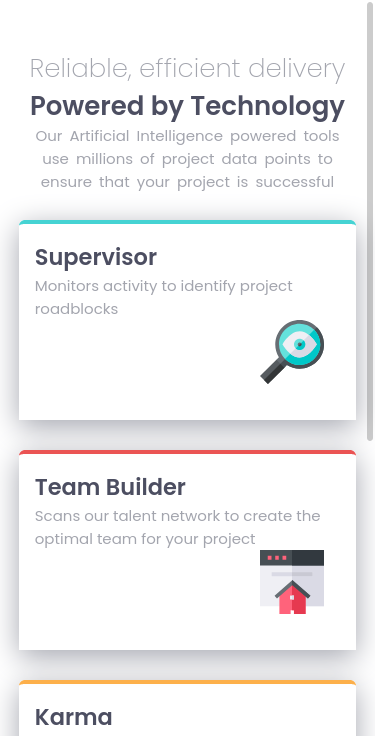

# Frontend Mentor - Four card feature section solution

This is a solution to the [Four card feature section challenge on Frontend Mentor](https://www.frontendmentor.io/challenges/four-card-feature-section-weK1eFYK). Frontend Mentor challenges help you improve your coding skills by building realistic projects. 

## Table of contents

- [Overview](#overview)
  - [The challenge](#the-challenge)
  - [Screenshot](#screenshot)
  - [Links](#links)
- [My process](#my-process)
  - [Built with](#built-with)
  - [What I learned](#what-i-learned)
- [Author](#author)

## Overview

### The challenge

Users should be able to:

- View the optimal layout for the site depending on their device's screen size

### Screenshot

Mobile version

Desktop version

### Links

- Solution URL: [Solution page]()
- Live Site URL: [Github pages]()

## My process

### Built with

- HTML
- CSS
- CSS Grid
- Mobile-first workflow

### What I learned

This time i decide to start using a css methodology like BEM, Atomic CSS, DOCSS, etc.

I learn [BEM](http://getbem.com/introduction/), because in [The State of CSS 2020](https://2020.stateofcss.com/en-US/technologies/methodologies/) was the first on usage.

I really like it and i want to see how many code can i re use in my next project.

## Author

- Frontend Mentor - [@Caresle](https://www.frontendmentor.io/profile/Caresle)
- Instagram - [@caresle1](https://instagram.com/caresle1)